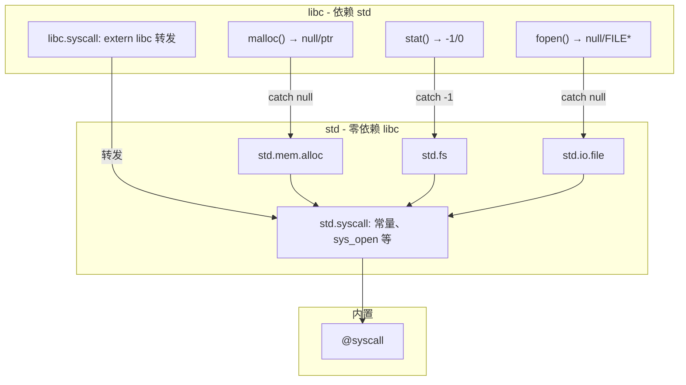

# libc 重构：std 充分 error + libc 薄封装 C 接口

## 原则：std 零依赖 libc

- **std**：仅依赖 `@syscall` 内置及 std 自身（std.mem.mem、std.string 等），不 use libc
- **libc**：C 兼容层，依赖 std，薄封装转为 C 风格返回值

## 目标架构



## 依赖关系

```
@syscall (内置)
    ↑
std.syscall (常量、sys_open、sys_close 等)
    ↑
std.mem.alloc, std.fs, std.io.file
    ↑
libc (syscall 转发 + stdlib/stdio 薄封装)
```

**std 不 use libc**。std 内部使用 std.mem.mem、std.string 等，不依赖 libc.mem、libc.string。

## 命名约定

不加 _try 后缀，通过模块路径区分。

| std 模块 | 函数 | 返回类型 |
|----------|------|----------|
| std.mem.alloc | malloc, calloc, realloc | !&void |
| std.fs | stat, opendir, readdir, closedir, readlink | !void / !&DIR / !isize |
| std.io.file | open, read, write, close | !&void / !isize |

## 错误类型

在 std 内直接使用 `return error.X`：

- error.OutOfMemory
- error.FileNotFound / error.OpenFailed
- error.AccessDenied
- error.InvalidHandle
- error.IOError

## 涉及文件

| 文件 | 改动 |
|------|------|
| lib/std/syscall.uya | 新建，从 libc.syscall 迁出常量与 sys_* 实现 |
| lib/std/mem/alloc.uya | 新建，malloc/calloc/realloc 使用 std.syscall |
| lib/std/fs.uya | 新建，stat/opendir 等使用 std.syscall |
| lib/std/io/file.uya | 增强，改用 std.syscall，open/read 返回 !T |
| lib/libc/syscall.uya | 薄封装，extern "libc" fn 转发到 std.syscall |
| lib/libc/stdlib.uya | 调用 std，catch 转 null/-1 |
| lib/libc/stdio.uya | 调用 std.io.file，catch 转 null/-1/0 |

## 兼容性

- libc 导出的 C 接口签名与返回值语义不变
- 现有 use libc.sys_open、libc.O_RDONLY 等需改为 use std.syscall（编译器 src/、测试等）
- extern_decls.uya 仍 use libc.* 获取 C 风格接口，无需改
