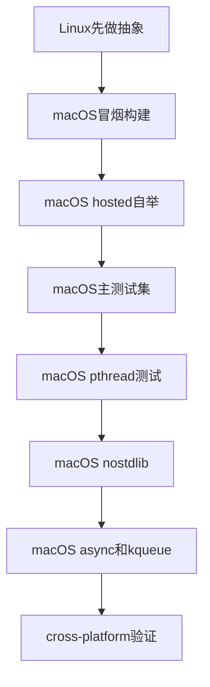

# Uya macOS 迁移计划

## 目标与范围

- 目标：让 `uya` 在 macOS `arm64` 与 `x86_64` 上达到 `full_platform` 水平，包括普通构建、主要运行时能力、`@syscall`、`osal`、`pthread`、`--nostdlib`、`async/kqueue` 与平台测试。
- 原则：先拆平台抽象，再在 macOS 真机完成 bring-up；优先让“普通 libc 链接路径 + hosted 自举验证”跑通，再补齐 `pthread`、`--nostdlib` 和 `async`。
- 当前关键 Linux 绑定点不止于构建链：
- `[src/main.uya](src/main.uya)` 依赖 `/proc/self/exe`、Linux 风格 `dirent` 偏移和 GCC 路径假设。
- `[lib/libc/syscall.uya](lib/libc/syscall.uya)` 与 `[lib/syscall/linux.uya](lib/syscall/linux.uya)` 都写死了 Linux syscall 号。
- `[lib/osal/osal.uya](lib/osal/osal.uya)` 建立在 `use syscall.*` 之上，当前只存在 Linux 后端。
- `[lib/libc/pthread.uya](lib/libc/pthread.uya)` 基于 `clone + futex + waitpid`，不是可忽略的边角模块。
- `[lib/std/runtime/runtime.uya](lib/std/runtime/runtime.uya)`、`[lib/std/runtime/entry/entry.uya](lib/std/runtime/entry/entry.uya)`、`[src/compile.sh](src/compile.sh)` 带有 Linux-only 的退出、栈设置、`_start` 和 CRT 假设。
- `[lib/std/async_event.uya](lib/std/async_event.uya)`、`[lib/std/async.uya](lib/std/async.uya)` 以及 `tests/test_async_fd.uya`、`tests/test_std_async_event.uya` 还带有 epoll、errno、`pipe2` 和常量绑定。

## 迁移分阶段

### 阶段 1：构建链平台化

- 修改 `[Makefile](Makefile)` 与 `[src/compile.sh](src/compile.sh)`，把编译器/链接器从硬编码 `gcc` 改为可配置 `CC`，默认优先兼容 `clang`。
- 去掉 Linux 风格的 PATH/CRT 假设，改为按平台探测链接参数与启动对象文件。
- 保留现有 Linux 路径，新增 Darwin 分支，但此阶段只要求普通 hosted 链接路径设计清晰。
- 产出：形成统一的 host-toolchain 抽象，Linux 上不回归，macOS 上具备最小链接入口。

### 阶段 2：编译器宿主平台抽象

- 在 `[src/main.uya](src/main.uya)` 中重构宿主相关逻辑：
- 抽象 `get_compiler_dir()`，将 Linux 的 `/proc/self/exe` 路径发现替换为“Linux + Darwin”分支，Darwin 走 `_NSGetExecutablePath` 或等价机制。
- 抽象临时目录与工具调用，消除对 Linux GCC 安装路径的依赖。
- 处理目录遍历/`dirent` 布局差异，避免直接依赖 Linux 结构体偏移。
- 产出：编译器在 macOS 上能正确找到自身与 `UYA_ROOT`，并能稳定调用本机 `clang/gcc`。

### 阶段 3：`@syscall`、`syscall/osal` 与运行时跨平台

- 在 `[src/codegen/c99/main.uya](src/codegen/c99/main.uya)` 为 `@syscall` 增加 Darwin 分支，分别覆盖 `x86_64` 与 `arm64` 调用约定。
- 将 `[lib/libc/syscall.uya](lib/libc/syscall.uya)` 从“Linux syscall 常量集合”提升为平台分层入口，新增 Darwin 对应模块或条件分支。
- 为 `[lib/syscall/linux.uya](lib/syscall/linux.uya)` 增加 Darwin 对应实现，并建立 `use syscall.*` 的平台选择机制，避免 `osal` 继续卡死在 Linux-only 后端。
- 校准 `[lib/osal/osal.uya](lib/osal/osal.uya)` 中常量、结构体、目录和时间相关封装，保证 `test_osal.uya` 这类标准库测试有落点。
- 修正 `[lib/std/runtime/entry/entry.uya](lib/std/runtime/entry/entry.uya)` 与 `[lib/std/runtime/runtime.uya](lib/std/runtime/runtime.uya)` 中硬编码的 Linux syscall 号与退出路径，优先改为平台分支或 libc 封装。
- 产出：普通构建路径下，Uya 生成的程序在 macOS 上可执行，基础文件/进程/时间能力可用，`osal` 具备进入测试阶段的条件。

### 阶段 4：hosted 自举与测试基线

- 先在 macOS 上跑通非 `--nostdlib` 自举路径，优先使用标准 libc 链接验证编译器主流程。
- 为 `[Makefile](Makefile)` 和相关脚本补一个明确的 hosted 验证入口，例如 hosted 版 `b/check` 或等价目标，避免现有 `b` 仍然强绑 `--nostdlib`。
- 调整 `[tests/run_programs_parallel.sh](tests/run_programs_parallel.sh)` 以支持 Darwin：
- 选择 `clang`/`gcc`；按平台应用链接参数。
- 对 Linux 专用测试建立跳过机制，先不让 `epoll`、Linux syscall、Linux 线程语义用例阻塞整体迁移。
- 复核 `[tests/run_cross_platform_tests.sh](tests/run_cross_platform_tests.sh)` 的平台判断与脚本问题，形成 macOS smoke/self-host/tests 三层验证。
- 产出：macOS 上具备稳定的 `from-c -> hosted 自举 -> 主测试集` 基线。

### 阶段 5：`pthread` 与同步原语 Darwin 路线

- 单独处理 `[lib/libc/pthread.uya](lib/libc/pthread.uya)`，不要把它混在一般 syscall 兼容里一笔带过。
- 明确策略二选一：
- 过渡路线：在 macOS 先桥接系统 `libpthread`，优先让 `tests/test_pthread.uya`、`tests/test_pthread_cond.uya` 可通过。
- 长期路线：若仍坚持“零 libpthread 依赖”，再单独设计 Darwin 线程/同步实现，替代现有 `clone + futex + waitpid` 语义。
- 建立与主测试分离的 pthread 验收门槛，避免该子系统拖慢普通编译器 bring-up。
- 产出：macOS 上线程与同步能力有明确落地方案，不再成为 `full_platform` 的隐性缺口。

### 阶段 6：`--nostdlib` 与启动路径

- 重写 `[src/compile.sh](src/compile.sh)` 中 Linux 专用 `_start` 内联汇编与 `-nostdlib -static` 链接逻辑，为 Darwin `x86_64` 与 `arm64` 设计独立入口方案。
- 明确 macOS CRT/入口文件策略，避免沿用 Linux 的 `crti.o/crtn.o` 假设。
- 校准 `[lib/std/runtime/runtime.uya](lib/std/runtime/runtime.uya)` 中退出语义，确保 `--nostdlib` 模式与普通模式行为一致。
- 产出：macOS 上 `--nostdlib` 可编译、可链接、可运行，并能参与后续自举验证。

### 阶段 7：async Darwin 路径与 `kqueue`

- 将 `[lib/std/async_event.uya](lib/std/async_event.uya)` 拆为“公共接口 + Linux 后端 + macOS 后端”结构。
- 保留 `EventLoop`/`EventKind` 抽象，实现 Darwin `kqueue/kevent` 版本，对应替代当前 `LinuxEpoll`。
- 同步扩展 `[lib/std/async.uya](lib/std/async.uya)`，处理 `EAGAIN/EWOULDBLOCK`、`O_NONBLOCK`、`fcntl`、`pipe2`/替代路径等 Darwin 差异，而不只改事件后端。
- 改造 `tests/test_async_fd.uya`、`tests/test_std_async_event.uya` 等测试，把 Linux 写死常量与 `LinuxEpoll` 假设重构为平台分支或新测试矩阵。
- 产出：async 调度路径在 macOS 上可用，`async fd` 与事件循环测试恢复。

## 验证策略

- `L1` 冒烟：`from-c`、简单程序编译运行。
- `L2` hosted 自举：普通链接路径先过，并提供独立于 `--nostdlib` 的正式验证目标。
- `L3` 主测试：语言与标准库主测试先过，Linux 专属用例先跳过。
- `L4` pthread：线程/条件变量/同步测试单独建线，不与编译器基础 bring-up 混在一起。
- `L5` nostdlib：hosted 路径稳定后再补零依赖入口。
- `L6` async：`std.async` 本体和 `kqueue` 后端一起恢复。
- `L7` cross-platform：统一验证 Linux/macOS、`arm64/x86_64`。

## 优先修改文件

- `[Makefile](Makefile)`
- `[src/compile.sh](src/compile.sh)`
- `[src/main.uya](src/main.uya)`
- `[src/codegen/c99/main.uya](src/codegen/c99/main.uya)`
- `[lib/libc/syscall.uya](lib/libc/syscall.uya)`
- `[lib/syscall/linux.uya](lib/syscall/linux.uya)`
- `[lib/osal/osal.uya](lib/osal/osal.uya)`
- `[lib/std/runtime/entry/entry.uya](lib/std/runtime/entry/entry.uya)`
- `[lib/std/runtime/runtime.uya](lib/std/runtime/runtime.uya)`
- `[lib/libc/pthread.uya](lib/libc/pthread.uya)`
- `[lib/std/async.uya](lib/std/async.uya)`
- `[lib/std/async_event.uya](lib/std/async_event.uya)`
- `[tests/run_programs_parallel.sh](tests/run_programs_parallel.sh)`
- `[tests/run_cross_platform_tests.sh](tests/run_cross_platform_tests.sh)`
- `[tests/test_pthread.uya](tests/test_pthread.uya)`
- `[tests/test_pthread_cond.uya](tests/test_pthread_cond.uya)`
- `[tests/test_osal.uya](tests/test_osal.uya)`
- `[tests/test_async_fd.uya](tests/test_async_fd.uya)`
- `[tests/test_std_async_event.uya](tests/test_std_async_event.uya)`
- `[docs/std_async_design.md](docs/std_async_design.md)`

## 风险与应对

- Darwin `arm64` 的 `@syscall` ABI 与 Linux 完全不同：尽早单独验证，不要等到 async 阶段。
- `--nostdlib` 是最高风险项：不要在 hosted 构建和 hosted 自举未跑通前投入主力。
- `pthread` 不是小补丁：若继续坚持“零 libpthread 依赖”，它本身就是一个独立迁移子项目，需单独排期。
- `libc.syscall`、`syscall/linux.uya`、`osal`、`async_event` 当前存在 Linux 偏置：优先做模块分层，避免把 Darwin 逻辑继续塞进 Linux 文件中。
- `async` 不只是 `kqueue`：`std.async` 本体里的 errno、flag、pipe 行为也必须一起迁移，否则后端接通后仍会失败。
- 测试脚本本身有平台与工具链假设：尽早建立 Darwin 跳过列表和分层验证，否则问题会被混在一起。

