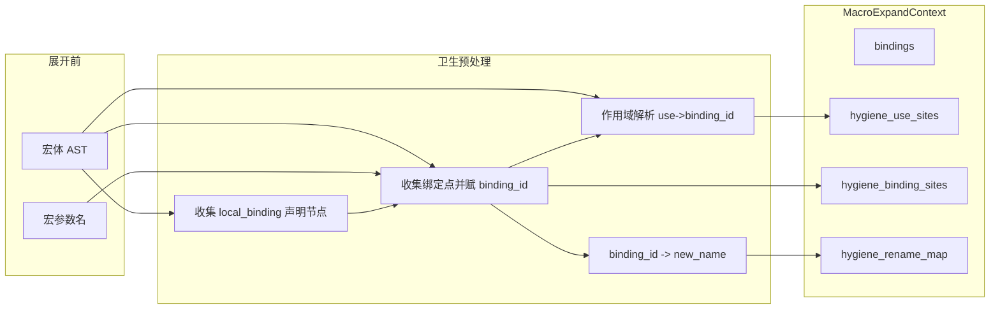

# Uya 卫生宏实现计划

## 目标

使宏体内**引入的局部标识符**（变量、循环变量、函数参数、`catch` 错误变量）在展开时被重命名为唯一名，从而：

- **宏体名字不被调用处捕获**：宏里写的 `var tmp = ...` 展开后不会误用调用处的 `tmp`
- **调用处名字不被宏体遮蔽**：调用处的 `x` 不会因为宏体里也声明了 `x` 而被错误绑定到宏的 `x`

**不变**：宏参数仍按实参 AST 替换；`const x = @mc_eval(...)` / `@mc_type(...)` 仍通过 `merged_ctx` 做“形参式”替换，不参与卫生重命名。

---

## 设计要点

### 1. 需重命名的绑定（macro-local）

- `AST_VAR_DECL` 的 `var_decl_name`（排除**具体声明节点**为 `const x = @mc_eval` / `@mc_type`）
- `AST_FOR_STMT` 的 `for_stmt_var_name`
- `AST_FN_DECL` 的 `fn_decl_params[i].var_decl_name`
- `AST_CATCH_EXPR` 的 `catch_expr_err_name`

**不**重命名：宏参数名（由 `find_param_binding` 替换）、会加入 `local_bindings` 的 const 名（由 merged_ctx 替换）、`AST_FN_DECL.fn_decl_name`（它通常属于宏输出的可见结果，不应首版默认改写）。

**首版范围**：仅处理 var/for/fn 参数/catch 错误变量，不处理 `fn_decl_name`、`struct_decl_name`、`enum_decl_name` 等声明名；若后续需要可再扩展 binding 种类与 binding_sites。

### 2. 作用域与“使用→绑定”对应

同一名字在不同作用域可多次绑定（如块内 `var x` 遮蔽外层 `x`），因此：

- 每个**绑定点**分配一个唯一的 `binding_id`（整数）
- `binding_id -> new_name` 的映射（如 `x -> x__hyg_7_0`）
- 对宏体做一次**作用域解析**：对整棵宏体 AST 递归遍历，**凡遇到 `AST_IDENTIFIER` 节点**（包括作为 `member_access_object`、`mc_interp_operand` 等子节点时）都做“使用→绑定”解析，并写入 use_sites（binding_id / 宏参数 / 自由名）

拷贝时：

- **绑定点**：查到该节点的 `binding_id`，则 `copy.xxx_name = rename_map[binding_id]`
- **标识符使用**：若解析为宏参数 → 保持现有“实参 AST 替换”；若解析为某 binding_id → `copy.identifier_name = rename_map[binding_id]`；否则 → 保持原名（在调用处解析）

### 3. 唯一名生成

使用 `name + "__hyg_" + expansion_id + "_" + binding_id`，其中 `expansion_id` 为每次宏展开递增的计数器。**实现二选一**：（a）在 `TypeChecker` 上增加字段（如 `macro_expansion_counter`），每次展开前递增；（b）在 macro_expand 模块内用静态变量。当前编译为单线程，不考虑并发。

### 4. 节点到 binding_id 的映射

AST 节点无内置 id 字段，用**旁表**在 arena 上分配：

- **use_sites**：`(node: &ASTNode, binding_id: i32)` 的线性表；`binding_id` 约定：`-1` = 宏参数，`-2` = 自由名，`>= 0` = macro-local 的 binding_id
- **binding_sites**：`(node: &ASTNode, binding_id: i32)`，覆盖 var_decl / for_stmt / fn 的 param / catch_expr 节点

拷贝时用“当前节点指针”在表中线性查找即可（宏体规模小，O(n) 可接受）。查找时若 `binding_id >= 0` 须保证 `binding_id < hygiene_rename_count`，避免 rename_map 越界。

---

## 数据流

展开时：先对**当前宏的 body** 跑一遍 hygiene 预处理，得到 `use_sites`、`binding_sites`、`rename_map`，填入 `MacroExpandContext`（或等价结构）；`extract_macro_output_with_params` 内构造 `merged_ctx` 时把上述 hygiene 相关字段一并拷贝过去；`deep_copy_ast_with_params` / `deep_copy_ast_with_field_subst` 在拷贝标识符和绑定点时按表查找并应用重命名或保持原样/替换实参。

---

## 实现步骤

### 阶段一：上下文与预处理

1. **扩展 [src/checker/macro_expand.uya](src/checker/macro_expand.uya) 中的 `MacroExpandContext`**
  - 增加字段（或单独结构体）：`hygiene_use_sites`、`hygiene_binding_sites`、`hygiene_rename_map`（`&(&byte)` 或等价）、`hygiene_rename_count`、`expansion_id`（或能生成唯一后缀的计数器）。
  - 若用线性表，可定义 `HygieneUseEntry { node: &ASTNode, binding_id: i32 }` 和 `HygieneBindingEntry { node: &ASTNode, binding_id: i32 }`，在 arena 上分配数组。
2. **实现“收集会进入 local_bindings 的声明节点”**
  - 与 [src/checker/macro_expand.uya](src/checker/macro_expand.uya) 中 `extract_macro_output_with_params` 开头的逻辑一致：遍历 body 顶层，对 `const x = @mc_eval(...)` 和 `const x = @mc_type(...)` 收集**声明节点本身**，得到集合 L（可用固定大小数组或 arena 上的节点表）。
3. **实现 `build_hygiene_data(body, param_names, local_binding_decls, arena, expansion_id)`**
  - 遍历宏体 AST，收集所有绑定点（var_decl / for_stmt / fn_decl_params[i] / catch_expr_err_name）；若绑定节点不在 `local_binding_decls` 且绑定名不在 `param_names`，则分配下一个 `binding_id`，写入 `binding_sites`，并在 arena 上生成 `new_name = name + "__hyg_" + expansion_id + "_" + binding_id`，写入 `rename_map[binding_id]`。
  - `fn_decl_name` 首版不参与 hygiene，避免改写宏输出的可见函数/方法名。
  - 再遍历宏体做作用域解析：维护“当前作用域内名字 -> binding_id”的栈或链式表；进入块/函数/for/catch 时按现有类型检查器顺序压栈，退出时弹栈；遇到标识符使用时，解析到 binding_id（或标记为 param / free），写入 `use_sites`。
  - 返回 `use_sites`、`binding_sites`、`rename_map`、`rename_count`（或封装成结构体）。
4. **两处展开入口均调用 `build_hygiene_data` 并写入 ctx**
  - 在 [src/checker/macro_expand.uya](src/checker/macro_expand.uya) 的 `expand_macros_in_node_simple` 中，**两处**构建 `ctx` 并调用 `extract_macro_output_with_params` 的路径都要在调用 extract 之前执行 hygiene 预处理：
    - **AST_CALL_EXPR 路径**（约 2755–2778 行）：识别到宏调用、构建好 `ctx.bindings` 之后，先得到 `local_binding_decls`，再调用 `build_hygiene_data(...)`，将结果填入 `ctx` 的 hygiene 字段。
    - **AST_METHOD_BLOCK 路径**（约 2862–2912 行）：对 struct 返回宏展开时，在构建好 `ctx.bindings` 之后同样先得到 `local_binding_decls`，调用 `build_hygiene_data(...)` 并填入 `ctx`，否则方法块内展开的宏会缺少卫生。
  - `local_binding_decls` 可与 `extract_macro_output_with_params` 内逻辑抽成共用函数（如 `collect_local_binding_decls(body, arena)`）。
5. `**extract_macro_output_with_params` 中构造 `merged_ctx` 时**
  - 在 `merged_ctx = *ctx` 之后，确保 `merged_ctx` 的 hygiene 相关字段与 `ctx` 一致（指针拷贝即可），这样后续 `deep_copy_ast_with_params(..., &merged_ctx, ...)` 能读到同一套 use_sites / binding_sites / rename_map。

### 阶段二：拷贝时应用卫生

1. **在 `deep_copy_ast_with_params` 中应用卫生**
  - **前置约定**：仅当 `ctx` 的 hygiene 相关字段非空（如 `hygiene_use_sites != null` 等）时才进行 use_sites/binding_sites 查找与重命名；否则保持当前逻辑（只做参数替换、不重命名），保证未传 hygiene 的调用路径行为不变。
  - **AST_IDENTIFIER**：若 `ctx` 带 hygiene 数据，先在 `use_sites` 中查当前节点；若查到且 `binding_id == -1`，按宏参数做 `find_param_binding` 并替换；若查到且 `binding_id >= 0`，则 `copy.identifier_name = rename_map[binding_id]`；若 `-2` 或未查到则 `copy.identifier_name = node.identifier_name`。若 `ctx` 无 hygiene 数据，保持现有逻辑（仅 `find_param_binding` 后替换或保留原名）。
  - **AST_VAR_DECL**：若在 `binding_sites` 中查到该 node 的 `binding_id`，则 `copy.var_decl_name = rename_map[binding_id]`，否则保持 `node.var_decl_name`。
  - **AST_FOR_STMT**：同上，对 `for_stmt_var_name` 查 `binding_sites` 并可能替换为 `rename_map[binding_id]`。
  - **AST_FN_DECL**：保持 `fn_decl_name` 原样；对 `fn_decl_params[i]` 的拷贝在递归到子节点时，每个 param 节点（var_decl）同样会走 AST_VAR_DECL 分支，因此只要 binding_sites 包含这些 param 节点即可。
  - **AST_CATCH_EXPR**：若在 `binding_sites` 中查到该 catch 节点的 `binding_id`，则 `copy.catch_expr_err_name = rename_map[binding_id]`，否则保持原名。
  - 递归时继续传入同一 `ctx`，保证子 AST 中标识符和绑定点使用同一套表。
2. **在 `deep_copy_ast_with_field_subst` 中同步卫生逻辑**
  - 该函数用于 `for info.fields` 的展开，也会拷贝宏体片段。为其传入的 `ctx` 已包含 hygiene 数据（来自同一次展开的 `merged_ctx`），在拷贝 `AST_IDENTIFIER`、`AST_VAR_DECL`、`AST_FOR_STMT`、`AST_CATCH_EXPR`、`AST_FN_DECL` 的参数节点时应用与 `deep_copy_ast_with_params` 相同的查找与重命名规则，保证 for 展开后的块内标识符也卫生。

### 阶段三：测试与文档

1. **新增测试**
  - 在 `tests/` 下增加 `test_macro_hygiene.uya`（或类似名称）：
    - 宏体内声明 `var tmp` 并使用 `tmp`，调用处也有 `tmp`；展开后宏生成的代码使用唯一名（如 `tmp__hyg_0_0`），不与调用处 `tmp` 冲突。
    - 宏体内有 `var x`，调用处传入实参并也有外层 `x`；展开后宏参数仍被实参 AST 替换，宏内的 `x` 被重命名，调用处的 `x` 在展开后的代码里仍指向外层。
    - 宏体内 `catch |err| { ... }` 与调用处同名 `err` 不互相干扰，验证 catch 绑定点也纳入 hygiene。
    - 顶层存在 `const info = @mc_type(T)`，内层再声明同名 `var info` 时，内层 `info` 仍会被重命名，验证 `local_bindings` 的排除是按节点而不是按名字。
    - **同一宏在同一文件内展开两次**：两处展开生成的局部名不同（expansion_id 或 binding_id 不同），验证唯一名生成正确。
  - 运行 `make check` 与现有宏测试（如 `test_macro_*.uya`）确保无回归。
2. **规范与文档**
  - 在 [docs/uya.md](docs/uya.md) 宏系统章节（§25）中增加“卫生宏”小节：说明宏体内引入的变量/循环变量/函数参数/`catch` 错误变量会做卫生重命名，避免与调用处名字捕获；宏参数与 `const x = @mc_eval/@mc_type` 的语义不变；`fn_decl_name` 首版保持原样。
  - 若有 [docs/todo_mini_to_full.md](docs/todo_mini_to_full.md) 或类似待办，可增加“卫生宏”已实现项。

---

## 关键文件与位置

| 修改点                   | 文件                                                                                           | 说明                                                                                          |
| --------------------- | -------------------------------------------------------------------------------------------- | ------------------------------------------------------------------------------------------- |
| 上下文与 hygiene 数据结构     | [src/checker/macro_expand.uya](src/checker/macro_expand.uya)                                 | `MacroExpandContext` 新增字段；可选 `HygieneUseEntry` / `HygieneBindingEntry`                      |
| 收集 local_binding 声明节点 | 同上                                                                                           | 可抽成 `collect_local_binding_decls(body, arena)`，供 build_hygiene 与 extract 共用                |
| build_hygiene_data    | 同上                                                                                           | 两遍遍历：绑定收集 + 作用域解析，写 use_sites / binding_sites / rename_map                                  |
| 展开入口（两处）              | 同上，`expand_macros_in_node_simple`：AST_CALL_EXPR 约 2755–2778 行、AST_METHOD_BLOCK 约 2862–2912 行 | 两处构建 ctx 后均调 build_hygiene_data，填 ctx；expansion_id 递增                                       |
| merged_ctx 传递 hygiene | 同上，`extract_macro_output_with_params` 约 1466–1493 行                                          | merged_ctx 拷贝 ctx 时保留 hygiene 指针                                                            |
| 拷贝时查表重命名              | 同上，`deep_copy_ast_with_params` 约 1109–1340 行                                                 | 仅当 ctx 含 hygiene 数据时做查找；对 AST_IDENTIFIER / VAR_DECL / FOR_STMT / CATCH_EXPR / FN 参数分支增加 hygiene 查找与赋值 |
| for 展开拷贝              | 同上，`deep_copy_ast_with_field_subst` 约 769–910 行                                              | 与 deep_copy_ast_with_params 相同的 hygiene 查找逻辑                                                |

---

## 风险与简化

- **作用域实现**：需正确处理块、for、fn 体、fn 参数与 catch 错误变量的作用域顺序，并严格镜像现有类型检查器的进入/插入顺序；不能使用“近似作用域”。
- **性能**：use_sites / binding_sites 线性查找；若后续宏体变大，可改为按 (line, column) 或节点指针的简单哈希。
- **唯一名格式**：`__hyg_%d_%d` 当前仅是实现约定；若要获得语言级“绝不冲突”保证，应在规范中显式保留该前缀。错误信息中可能显示生成名（如 `tmp__hyg_7_0`），友好还原为宏内原名可留作后续优化。

---

## 验收

- 现有所有宏测试（如 `make tests` 中 `test_macro*.uya`）仍通过。
- 新增卫生宏测试：宏内局部变量、`for` 变量、函数参数、`catch` 错误变量与调用处同名不互相干扰；`local_bindings` 的排除按节点生效；多次展开同一宏得到不同唯一名。
- 文档标明宏系统为卫生宏，并简要说明重命名规则与例外（参数、local_bindings）。

