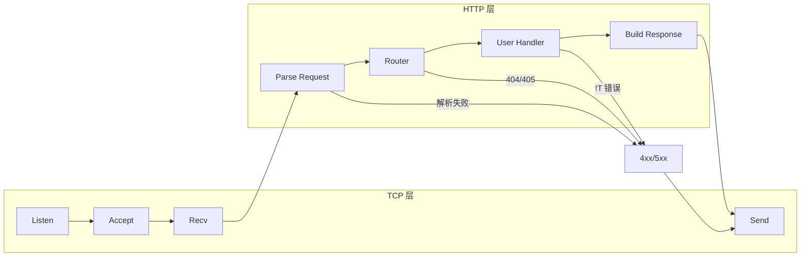

# 充分利用 Uya 语言特性的高性能 HTTP 框架计划

## 1. 目标与范围

- **目标**：实现一个高性能 HTTP/1.1 **服务端框架**，充分运用 Uya 的接口、`!T`、编译期证明、RAII、模块与（可选）异步等特性，并**完整支持 RESTful API** 与 **JWT 认证**。
- **范围**：本期以 **服务端** 为主（路由、中间件、Request/Response、解析、REST 能力、JWT 解析/验证）；**客户端** 可作为后续阶段（接口与类型可预留）。
- **性能策略**：先实现 **同步 + epoll 多路复用** 或 **每连接一线程** 的可用版本；待异步 CPS 完善后再接 `@async_fn` Handler，便于高并发。

## 2. 现状与依赖

- **TCP 层**：当前 [lib/libc/syscall.uya](lib/libc/syscall.uya) 仅有 read/write/open/close/epoll 等，**无 socket/bind/listen/accept**。需新增：
  - **方案 A（推荐）**：在 `syscall.uya` 中增加 Linux 的 socket 相关系统调用号（如 `SYS_socket`、`SYS_bind`、`SYS_listen`、`SYS_accept4`、`SYS_connect`、`SYS_sendto`、`SYS_recvfrom`），并用 `@syscall` 封装为 Uya 函数（与现有风格一致，便于零依赖构建）。
  - **方案 B**：通过 `extern "libc"` 声明并链接 libc 的 `socket`/`bind`/`listen`/`accept`/`send`/`recv` 等，实现快但依赖 libc。
- **I/O 与异步**：[lib/std/io/reader.uya](lib/std/io/reader.uya) 与 [lib/std/io/writer.uya](lib/std/io/writer.uya) 提供 `Reader`/`Writer` 接口；[lib/std/async.uya](lib/std/async.uya) 有 `Future<T>`/`Poll<T>`，但异步 CPS/状态机生成尚未完成（见 [docs/todo_mini_to_full.md](docs/todo_mini_to_full.md) §16）。**首版 server 完全不依赖 async 模块**，避免半成品集成；框架 API 可设计为「同步 Handler 先行，异步 Handler 后续接 Future/`@async_fn`」。
- **HTTP 解析**：项目内无现成 HTTP 解析器，需在 Uya 中实现**最小 HTTP/1.1 请求解析**（请求行 + 头部 + 可选 body 长度），便于利用**编译期证明**做缓冲区边界检查。
- **std.json 依赖**：REST 请求/响应体常为 JSON；若 [std.json](lib/std/json/) 尚未就绪（见 [todo_json.md](docs/todo_json.md)），首版仅提供 **body 切片**，由用户自行解析或延后「框架内 JSON 集成」；与 std.json 的集成作为可选步骤在 server 可用后追加。

## 3. 如何充分利用 Uya 特性


| 特性                   | 用法                                                                                                                                 |
| -------------------- | ---------------------------------------------------------------------------------------------------------------------------------- |
| **接口**               | 定义 `Handler`（如 `fn serve(self: &Self, ctx: &Context) !void;`，符合语法规范：方法签名 self 须为 `&Self`）、`Router`、中间件为「接收/返回 Handler」的组合，便于多态与测试。 |
| **错误联合 !T**          | 所有 I/O、解析、路由未匹配均返回 `!T`，强制调用方处理错误。                                                                                                 |
| **结构体 + 方法 + drop**  | `Request`、`Response`、`Conn`（封装 fd）带方法；`Conn` 在 drop 中 close fd，RAII 管理资源。                                                          |
| **编译期证明**            | 解析请求行/头部时对 `buf` 的索引与长度使用当前函数内的证明，保证不越界（配合 `@len`、区间分析）。                                                                           |
| **match + 枚举**       | HTTP Method、Status 使用 `enum`，用 `match` 穷尽处理；解析状态机也可用 enum。                                                                         |
| **模块与 export**       | 拆分为 `http.types`、`http.parse`、`http.router`、`http.server` 等，通过 `use`/`export` 控制边界。                                                |
| **defer / errdefer** | 在分配临时 buffer 或 fd 的分支中，用 defer 释放、errdefer 确保失败路径也关闭 fd。                                                                           |
| **切片 &[byte]**       | 请求体/响应体以切片形式暴露，避免不必要的拷贝；解析阶段在已知安全区间内使用切片。                                                                                          |
| **零 GC / 无隐式分配**     | 请求/响应使用栈或 Arena 上的缓冲区与结构体，不依赖运行时堆分配（与现有 std 风格一致）。                                                                                 |


## 4. 建议目录与模块划分

```
lib/
  std/
    http/
      types.uya      # 枚举 Method/Status，结构体 Request/Response/Context
      parse.uya      # HTTP/1.1 请求行+头部解析（含边界证明）
      router.uya     # 路由表与 Handler 接口、匹配逻辑
      server.uya     # 监听、accept、epoll 循环（或每连接一线程）、调用 Handler
      jwt.uya         # JWT 解析、验证（及可选签发）；Base64URL、签名（HS256 等）
      middleware.uya # 后续迭代：日志、恢复、CORS、JWT 认证中间件
```

- **types**：定义 `Method`、`Status`、`Request`（method, path, headers, body 切片）、`Response`（status, headers, body）、`Context`（request, response, conn 等）。**所有权与生命周期**：`Request` 持有 `**&[byte]`（借用）**，实际 buffer 由 Server/Conn 拥有（栈或每连接 buffer），确保 Handler 不会逃逸引用。Request 提供 header 访问（如方法 `fn get_header(self: &Self, name: &[byte]) !&[byte]`，name 为 header 名切片，符合 grammar slice_type），供 `get_bearer_token` 等使用；`**get_bearer_token(req: &Request) !&[byte]` 放在 types.uya 或同一模块的辅助函数**，避免 jwt 与 http 的循环依赖（jwt 仅提供 `verify(token, secret)`，由用户/中间件调用 get_bearer_token 后传入）。**path_params 与 query**：采用**固定容量线性数组**（key/value 对顺序存储），规模小（P=8、Q=16）时线性查找即可，不做哈希；超限返回 `error.TooManyParams`/`error.ValueTooLong`；P/Q/L 为编译期常量（如 8/16/256）。**错误类型统一**：在 types.uya 顶层预定义，例如 `error InvalidRequest;`、`error MethodNotAllowed;`、`error URITooLong;`、`error HeaderTooLarge;`、`error PayloadTooLarge;`、`error InvalidToken;`、`error InvalidBoundary;`、`error TooManyParts;`（后两者用于 multipart form），供 parse/router/jwt 使用。**Multipart form**：当 Content-Type 为 `multipart/form-data; boundary=...` 时，提供 Part 类型（name、filename、content_type、body）及 `parse_multipart` 或 `req.multipart() !MultipartView`，part 数量由常量（如 MAX_MULTIPART_PARTS）限定。
- **parse**：**API 优先使用 `parse(buf: &[byte]) !Request`**，保留切片边界信息，便于编译期证明（证明范围仅限当前函数，跨函数需显式传递长度；切片携带 len 更利于证明）。内部使用 `match` 与状态机，所有 `buf[i]` 访问需在**当前函数内**满足 `i >= 0 && i < @len(buf)`（例如 `while i < len && buf[i] != ' ' { i += 1; }`，循环条件保证下标安全）。**Keep-alive 与请求边界**：同一连接上多请求按「请求行 + 头部 + Content-Length 指定长度的 body」切分；解析完一个 Request 后，剩余数据作为下一请求的输入，直至无完整请求或连接关闭。**Multipart**：当 body 的 Content-Type 为 multipart/form-data 时，按 boundary 切分 part，解析每个 part 的 Content-Disposition（name、filename）、Content-Type 与 body 切片；part 数受 MAX_MULTIPART_PARTS 限制，解析失败返回 InvalidBoundary/TooManyParts。
- **router**：提供 `interface Handler { fn serve(self: &Self, ctx: &Context) !void; }`（接口方法签名须含 `self: &Self`，见语法规范）；Router 持有一组 (method, path_pattern) -> Handler 的映射，**路由表容量**由编译期常量限定（如 MAX_ROUTES），不用字面常数；注册超过上限时返回错误或断言；支持**路径参数**（如 `/users/:id`）、静态路径与前缀；未匹配时返回 404，方法不允许时返回 405。详见下文 RESTful 支持。
- **server**：封装 socket listen/accept；**首版并发模型**采用「阻塞 accept + 每连接一线程」（实现简单、易调试）；需**明确约束**：线程栈默认约 8MB（Linux），如 max_connections=1000 则虚拟内存约 8GB，应在配置中限制。**ServerConfig** 结构体首版即预留，包含：`mode: ServerMode`（枚举字面量用完整形式 **ServerMode.Blocking** / **ServerMode.Epoll** / **ServerMode.ThreadPool**，符合 BNF `enum_literal = ID '.' ID`；首版仅实现 Blocking）、`max_connections: i32`，便于后续扩展；epoll 路径在 server.uya 设计时预留接口。每个连接：读 -> parse -> router.serve(ctx) -> 写回；Conn 用结构体 + drop 关闭 fd。**请求 body 边界**：首版约定「单次 read 的 buffer 即整请求上限」或「Content-Length 不超过固定 N（如 64KB）」；超过则返回 413 或 error，不承诺分块读大 body，与零分配目标一致。
- **jwt**：提供 JWT 的**解析**（header.payload.signature 三段 Base64URL）、**验证**（签名校验，首版支持 HS256）、**可选签发**（encode + sign）。**Claims**：首版采用 **raw payload 切片**，不依赖 std.json；可选提供 `**jwt.decode_base64url(payload_slice) !&[byte]`** 辅助函数（JWT payload 为 Base64URL 编码的 JSON）。**exp 校验**：首版可选实现 `jwt.has_expired(payload_slice) bool`；若首版不校验 exp，文档注明「仅验签，不校验过期」。**依赖与循环**：jwt 模块**仅提供** `verify(token, secret)`（及 decode/sign），**不依赖** http 的 get_bearer_token；`get_bearer_token` 放在 types.uya 或同模块，由用户/中间件先取 token 再调 `jwt.verify`，避免 jwt↔http 循环依赖。**FFI**：若通过 FFI 调用 OpenSSL，需正确处理 `*const byte` 与 `&[byte]` 的转换（见语法规范指针规则）。  
- **middleware**：**首版至少定义 Middleware 接口类型**（即使不实现具体中间件），便于后续扩展与类型统一，例如 `interface Middleware { fn process(self: &Self, ctx: &Context, next: Handler) !void; }`；实现为「包装 Handler」：如 `fn logging(next: Handler) Handler`、`fn jwt_auth(next: Handler, secret: &[byte]) Handler`。首版不交付具体中间件实现，避免范围膨胀。

## 5. 完整支持 RESTful API

为完整支持 RESTful API，框架需提供以下能力（均在类型与路由/解析中体现）：

- **HTTP 方法**：`Method` 枚举覆盖 GET、POST、PUT、PATCH、DELETE、OPTIONS、HEAD；路由按 (method, path) 精确匹配，支持 405 Method Not Allowed。
- **路径参数（Path params）**：路由模式支持占位符（如 `/users/:id`、`/posts/:postId/comments/:commentId`），解析后写入 `Request` 的 `path_params`（如 `id => "123"`），供 Handler 按资源 ID 处理；匹配与提取均在 router 层完成，边界由证明保证。
- **查询字符串（Query string）**：请求行中的 `?key=value&...` 解析到 `Request.query`（或 `get_query(ctx, key)`），便于过滤、分页（如 `?page=1&limit=10`）。
- **状态码**：`Status` 枚举覆盖常用 REST 语义：200 OK、201 Created、204 No Content、400 Bad Request、404 Not Found、405 Method Not Allowed、409 Conflict、500 Internal Server Error 等；Handler 通过 `ctx.response.status = Status.Created` 等设置。
- **请求体 / 响应体**：POST/PUT/PATCH 的 body 通过 `Request.body` 切片访问；支持 `Content-Type: application/json`，与 [std.json](lib/std/json/) 结合做 JSON 反序列化；支持 **multipart/form-data**（表单与文件上传），通过 parse_multipart 或 req.multipart() 得到 Part 列表（name、filename、content_type、body）。Response 可设置 `Content-Type` 并写入 JSON（或纯文本/二进制）。
- **资源式路由**：同一资源不同方法映射到不同逻辑（如 GET /users/:id 与 DELETE /users/:id），通过 Router 注册多个 (method, path_pattern) 即可；可选提供「资源组」API：Uya 函数调用为**位置实参**，可用结构体字面量承载多个 Handler，如 `router.resource("/users", ResourceHandlers{ get: h1, post: h2, get_by_id: h3, put: h4, delete: h5 })`（`ResourceHandlers` 为含 get/post/… 字段的结构体），便于书写。
- **OPTIONS / CORS**：若需跨域，可在中间件中根据 `Method.Options` 或 `Origin` 头返回 Allow 与 CORS 头；RESTful 下 OPTIONS 可返回 204 + Allow 列出支持的 method。
- **JWT 认证**：支持从 `Authorization: Bearer <token>` 提取 token（通过 `get_bearer_token(req)`），并由 [std.http.jwt](lib/std/http/jwt.uya) 做解析与验证（HS256）；Handler 或 JWT 中间件可调用 `jwt.verify(token, secret)` 得到 payload/claims，**未携带或无效 token 时返回 401 Unauthorized**；已认证但权限不足由**业务 Handler 返回 403 Forbidden**（JWT 中间件只负责 401）。可选提供 `jwt.sign(payload, secret)` 用于登录接口签发 token。

上述能力在 **http.types**（Method/Status/Request 含 path_params 与 query）、**http.parse**（请求行含 path+query、头部 Content-Type、body 切片）、**http.router**（路径参数匹配与提取、405 处理）、**http.jwt**（解析/验证/可选签发）中实现；测试需覆盖典型 REST 场景（如 CRUD、路径参数、query、状态码与 body）以及 JWT 解析与验证用例。

## 6. 性能指标与验证

### 6.1 性能指标

框架需在文档与 CI/本地可重复地度量以下指标（便于对标 Fasthttp/Go、Rust 等同类实现，并做回归对比）：


| 指标              | 含义                                                 | 目标/基线（示例，可按机器调整）                                            |
| --------------- | -------------------------------------------------- | ----------------------------------------------------------- |
| **QPS / RPS**   | 每秒请求数（requests per second），纯 plaintext 或简单 JSON 响应 | 首版：与同机 Go net/http 同场景可比；后续：争取接近或优于 Go fasthttp 同配置的 50% 以上 |
| **延迟（Latency）** | 单请求响应时间                                            | 报告 p50、p95、p99（毫秒）；首版 p99 不超过同机 Go net/http 的 2 倍           |
| **并发连接数**       | 保持-alive 下可稳定支持的并发连接数                              | 记录「无错误、QPS 不降」时的最大并发（如 1k、10k）                              |
| **内存占用**        | 进程常驻内存（RSS）及每连接预估占用                                | 记录空载 RSS 与 1k/10k 连接时的增量，便于评估零 GC 优势                        |
| **解析吞吐**        | 仅 HTTP 解析（不含网络 I/O）的吞吐                             | 可选：benchmark 仅 parse 的 MB/s 或 请求/s，验证解析路径无瓶颈                |


- 场景约定：至少包含 **plaintext**（如 `GET /` 返回固定短文本）、**简单 JSON**（如 `GET /api/status` 返回小 JSON）、**带 path 参数**（如 `GET /users/123`）；**body 大小档位**：定义 small/medium/large（如 1KB/10KB/100KB）便于对比；**可选（后续迭代）**：带 `Authorization: Bearer <token>` 的请求。**首版基线**仅包含 plaintext 与简单 JSON，不含 JWT 场景。
- 环境注明：记录 CPU、内存、OS、编译器版本（如 `uya --c99` + gcc -O2）；**CPU 亲和性**：是否绑定核心影响多核 scaling，需在文档中注明（如「默认不绑定」或「可选 -cpu 参数」），便于复现。

### 6.2 验证方式

- **基准程序**：在 `tests/` 或 `benchmarks/` 下提供可运行的 HTTP 服务示例（如 `bench_http_server.uya` 或通过 `examples/http_server.uya`），暴露固定端口或通过环境变量配置，供压测工具调用。
- **压测工具**：使用 **wrk** 时**明确 keep-alive**（如 `-H "Connection: keep-alive"` 或 wrk 默认行为），并在脚本/文档中写明；示例 `wrk -t4 -c100 -d30s http://127.0.0.1:8080/`；脚本内记录 QPS、延迟分布（wrk 可输出 Latency Distribution）。
- **脚本与 Make**：提供 `make bench-http` 或 `scripts/bench_http.sh`：启动服务（后台）、运行 wrk/ab、解析输出并打印上述指标。**回归检测**：将基线数据存入 `benchmarks/baseline.json`（或等价），脚本自动对比；允许 **±5% 波动**，超出则返回非零并提示。
- **单元/集成测试**：`tests/test_http_*.uya` 覆盖功能正确性；性能验证与功能测试分离，但可在同一 `make check` 后执行 `make bench-http`（或单独执行）。
- **文档**：在 `docs/` 或 README 中增加「HTTP 框架性能」小节，记录当前指标、环境与复现步骤，并在发布或大改动后更新。

实现顺序中需预留「性能基准与验证」步骤：在 server 可运行后，添加基准程序与脚本，建立首版基线并写入文档；后续改动可对比该基线做回归验证。

## 7. 数据流概览




- 连接生命周期：`accept` 得到 fd -> 包装为 `Conn`（RAII，drop 签名为 `fn drop(self: Conn) void` 按值，见 uya.md §4）-> 读入到 buffer -> `parse` 得到 `Request`（含 path、query、body）-> 构建 `Context` -> `router.serve(&ctx)`（匹配 method+path、填充 path_params）或中间件链 -> 写回 `Response`（含 status、headers、body）-> 返回或 keep-alive 继续循环。**错误路径**：parse 失败、路由 404/405、Handler 返回 `!T` 错误时，均写入对应 4xx/5xx 响应后经 Send 返回。

## 8. 实现顺序建议

1. **TCP 基础设施**
  - 在 [lib/libc/syscall.uya](lib/libc/syscall.uya)（或新文件如 `lib/libc/socket.uya`）增加 socket 相关系统调用号与封装（socket, bind, listen, accept4, connect, send, recv，及 AF_INET/SOCK_STREAM 等常量）；**与现有 epoll 封装风格一致**（命名、错误返回、常量定义方式），便于维护。  
  - 可选：fcntl 设置 O_NONBLOCK，与现有 epoll 配合。
2. **http.types**
  - 定义 `Method`（GET/POST/PUT/PATCH/DELETE/OPTIONS/HEAD）、`Status`（200/201/204/400/404/405/409/500 等）、`Request`（method, path, path_params, query, headers, body 切片）、`Response`、`Context`、`Conn`（封装 fd，实现 drop 关闭）；**错误类型在 types.uya 顶层统一预定义**（InvalidRequest、MethodNotAllowed、URITooLong、HeaderTooLarge、PayloadTooLarge、InvalidToken、InvalidBoundary、TooManyParts 等），供 parse/router/jwt 使用。  
  - Request 持有 body 等为 `&[byte]`（借用），buffer 由 Server/Conn 拥有；Request 提供 path_params 与 query 的访问（线性数组查找）、以及 multipart 时 Part/MultipartView 的访问（常量 MAX_MULTIPART_PARTS 限定 part 数），便于 RESTful Handler 与表单/文件上传使用。
3. **http.parse**
  - 实现「请求行（含 path + query）+ 头部 + body」解析，输入为 `&[byte]` 或 `(buf, len)`，输出为 `Request` 或 `!Request`。  
  - 在解析逻辑中只使用编译器可证明的索引与长度（避免越界），错误情况返回 `error.XXX`；支持 Content-Type、Content-Length，为 REST 请求体提供 body 切片；当 Content-Type 为 multipart/form-data 时，支持按 boundary 解析 part（parse_multipart 或等价 API）。
4. **http.router**
  - 定义 `Handler` 接口与 `Router` 结构体，注册 (method, path_pattern) -> handler；path_pattern 支持路径参数（如 `/users/:id`）。  
  - `serve(ctx)` 中根据 `ctx.request` 的 method 与 path 匹配路由，提取 path_params 写入 ctx；未匹配返回 404，方法不匹配返回 405。
5. **http.server**
  - 实现 `Server`：bind + listen，**首版采用阻塞 accept + 每连接一线程**；**ServerConfig** 含 `mode: ServerMode`（首版仅 **ServerMode.Blocking**）、`max_connections: i32`（约束线程数/虚拟内存，见 §4）；epoll 路径预留接口。  
  - 每个连接：读 -> parse -> router.serve(ctx) -> 写回；使用 `Conn` 的 RAII 与 defer/errdefer 保证资源释放；body 大小策略见 §4（Content-Length ≤ 约定上限）。
6. **测试与示例**
  - 在 `tests/` 下增加 `test_http_*.uya`：解析用例、路径参数与 query 解析、路由匹配、REST 风格 CRUD（GET/POST/PUT/DELETE + 状态码与 body）、**multipart form**（test_http_multipart.uya：boundary、part name/filename/body、TooManyParts/InvalidBoundary）、最小 echo 服务；**JWT**：增加 `test_http_jwt.uya` 覆盖 Base64URL、三段解析、verify 有效/无效/错误签名、可选 get_bearer_token 提取。  
  - **模糊测试（Fuzzing）**：HTTP 解析器为攻击面，建议用随机字节流测试边界与异常输入。  
  - **内存安全与错误路径**：利用 Uya 编译期证明，测试覆盖所有 `!T` 错误路径，确保无未处理错误分支。  
  - **测试运行约定**：仅解析/路由的单元测试不依赖网络，随 `make tests` / `make check` 运行；若需起真实服务的集成测试，使用固定端口或环境变量 `HTTP_TEST_PORT`，并在脚本/文档中说明。  
  - 示例程序：`examples/http_server.uya` 展示 RESTful 路由注册（含 path params）与启动服务。
7. **http.jwt**
  - 实现 `jwt.uya`：Base64URL 解码、JWT 三段解析（header.payload.signature）；**验证** `jwt.verify(token, secret)` 返回 **raw payload 切片**，首版不依赖 std.json；**可选** `jwt.decode(token)`（不验签）、`jwt.sign(payload, secret)`（签发）、`**jwt.decode_base64url(payload_slice) !&[byte]`**（JWT payload 为 Base64URL 编码）；**exp**：首版可不校验，或提供 `jwt.has_expired(payload) bool`。  
  - **get_bearer_token** 放在 types.uya 或同模块（见 §4），jwt 仅提供 verify/decode/sign，由用户/中间件调用 get_bearer_token 后传入 token，避免循环依赖。  
  - 测试覆盖有效/无效/错误签名 token；若实现 exp 校验则增加过期用例。
8. **性能基准与验证**
  - 提供可压测的基准程序及 `scripts/bench_http.sh` 或 `make bench-http`：启动服务、用 wrk（明确 keep-alive）、解析输出并打印 QPS、p50/p95/p99、可选内存与并发连接数。  
  - **首版基线仅包含 plaintext 与简单 JSON**，不含 JWT 场景；建立基线并写入 `docs/http_performance.md` 与 `benchmarks/baseline.json`，回归允许 ±5%（见 §6.2）。
9. **（后续）异步、中间件与客户端**
  - 当 [docs/async_loop_await_design.md](docs/async_loop_await_design.md) 中 CPS/状态机就绪后，可增加 `@async_fn` Handler 与基于 Future 的 serve 路径；  
  - **middleware** 在本阶段实现（如 logging、recovery、CORS、**jwt_auth**；首版已定义 Middleware 接口类型），**仅负责无/无效 token 时返回 401**；403 由业务 Handler 返回；  
  - 客户端可单独设计为 `http.client` 模块（使用同一套 types/parse 的响应解析）。
10. **（可选，后续）与 std.json 集成**
  - 当 [std.json](lib/std/json/) 可用时，提供便捷方法（如 `ctx.body_as_json()` 或辅助函数）将 Request.body 与 Response 与 JSON 互转；若 std.json 未就绪，本步跳过，仅保留 body 切片 API。明确为**后续阶段**，不与 JWT/性能步骤混淆。

## 9. 关键文件与规范引用

- 语言规范与类型/证明/错误处理：[docs/uya.md](docs/uya.md)（§2 类型、§4 结构体、§5 函数、§6 接口、§12 内存与 RAII、§14 内存安全）。  
- **语法规范符合性**：[docs/grammar_formal.md](docs/grammar_formal.md)（BNF）、[docs/grammar_quick.md](docs/grammar_quick.md)（速查）。本计划中所有 API 草图须符合：**接口方法** `self: &Self`（`method_sig = 'fn' ID '(' [ param_list ] ')' type ';'`）；**函数/方法参数**显式类型；**错误**：预定义 `error ID ;`、引用 `error.ID`、返回类型 `!T`；**drop** 为 `fn drop(self: T) void`（按值，仅一参）；**枚举字面量** 完整形式 **EnumName.VariantName**（BNF `enum_literal = ID '.' ID`，如 ServerMode.Blocking、Status.OK）；**切片** `&[byte]` 或 `&[T; N]`；**内置** `@len(expr)` 等；**结构体字面量** `ID { field: expr }`；无命名实参（多参数用结构体字面量）。  
- 模块与导出：[docs/uya.md](docs/uya.md) §1.5；**模块即目录**，`lib/std/http/` 为单模块 `std.http`，其下 types.uya/parse.uya 等为同模块内多文件，非子模块。  
- 开发与测试流程：先写 `tests/test_http_*.uya`，再实现；`make check` / `make backup` 与 `--c99` / `--uya --c99` 双路径验证（见 [.cursorrules](.cursorrules) 与 [docs/todo_mini_to_full.md](docs/todo_mini_to_full.md)）。HTTP 单元测试（解析、路由）无网络；集成测试若需端口，见 §8 第 6 步约定。
- **语法规范再次评审（对照 BNF）**：已与 [grammar_formal.md](docs/grammar_formal.md) 逐项核对。**枚举**：字面量为 `ID '.' ID`（如 `Status.OK`、`ServerMode.Blocking`），文中已统一为完整形式。**错误**：预定义 `error InvalidRequest;`（`error_decl`），引用/返回 `error.InvalidRequest`（`error_type`）；示例用 error 类型而非 Status 枚举。**接口**：方法签名为 `fn ID '(' param_list ')' type ';'`，首参为 `self: &Self`。**get_header**：name 参数为 header 名切片 `name: &[byte]`（符合 slice_type），非单字节 `&const byte`。**drop**：仅一参且按值 `self: T`，返回 `void`；只能在结构体内部或方法块中定义（uya.md §12）。**切片/数组**：`slice_type = '&[' type ']' | '&[' type ';' NUM ']'`，`array_type = '[' type ':' NUM ']'`；常量用 `const_decl`。**内置**：`@len(expr)` 等以 `@` 开头。附录骨架 get_header 已改为 `name: &[byte]`，与 BNF 一致。

## 10. 风险与取舍

- **Socket 来源**：若采用 syscall 封装，需维护 Linux 系统调用号与结构体（如 sockaddr_in）；若采用 libc，则依赖 libc，但可更快支持多平台。  
- **并发模型**：首版为阻塞 accept + 每连接一线程；高并发优化依赖后续 epoll 与异步运行时/CPS 完成。  
- **解析完整性**：首版可只支持 HTTP/1.1 请求行与主要头部（Host, Content-Length 等），chunked 与 HTTP/2 可后续扩展。  
- **std.json**：若首版时 std.json 未就绪，REST 的 JSON body 仅以切片暴露，不提供框架内反序列化；待 std.json 可用后再做可选集成（见 §8 第 8 步）。  
- **JWT / 加密**：JWT 验证依赖 HMAC-SHA256（HS256）；若 Uya 尚无加密标准库，需通过 FFI 调用 libc/OpenSSL 或自带最小 HMAC-SHA256 实现。JWT 首版**不依赖 std.json**，verify 返回 raw payload 切片；若 std.json 已就绪，用户可自行解析 payload 或后续提供结构化 Claims。

## 11. 附录：最小示例骨架

以下为可运行的伪代码骨架，便于实现时对齐 API（语法符合 Uya 规范，具体实现以实际代码为准）：

```uya
// 类型与接口（types.uya）
enum Method { GET, POST, ... }
enum Status { OK = 200, NotFound = 404, ... }
error InvalidRequest;
error MethodNotAllowed;

struct Request { method: Method, path: &[byte], body: &[byte], ... }
Request { fn get_header(self: &Self, name: &[byte]) !&[byte] { ... } }

struct Response { status: Status, ... }
struct Context { request: Request, response: Response, conn: Conn }
struct Conn { fd: i32, fn drop(self: Conn) void { close(fd); } }

interface Handler { fn serve(self: &Self, ctx: &Context) !void; }
fn get_bearer_token(req: &Request) !&[byte] { ... }

// 解析（parse.uya）
fn parse(buf: &[byte]) !Request { ... }

// 路由与服务（router.uya, server.uya）
struct Router { ... }
Router { fn serve(self: &Self, ctx: &Context) !void { ... } }

enum ServerMode { Blocking, Epoll, ThreadPool }
struct ServerConfig { mode: ServerMode, max_connections: i32 }
fn run_server(config: ServerConfig, router: Router) !void { ... }
```

术语统一：全文使用「Uya」指代语言与项目，避免混用「优雅语言」等别名。

本计划不修改编译器核心，仅新增 lib 层代码与测试；所有 API 设计围绕「充分利用 Uya 特性」与「高性能、可证明安全」展开。