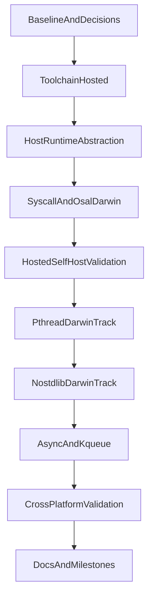

# macOS 迁移详细待办

基于现有迁移计划与代码现状，本文档用于指导 Uya 在 macOS 上完成 `full_platform` 级别迁移。目标平台覆盖：

- `x86_64 macOS`
- `arm64 macOS`

目标范围包括：

- 编译器宿主运行
- 普通 hosted 构建
- `@syscall`
- `lib/libc/syscall.uya`
- `lib/syscall/`
- `osal`
- `pthread`
- `--nostdlib`
- `std.async` / `std.async_event` / `kqueue`
- 主测试集与跨平台验证

执行前请同时阅读：

- [macos_hosted_smoke.md](macos_hosted_smoke.md)（macOS 上 hosted 冒烟与 from-c 限制）
- [todo_mini_to_full.md](todo_mini_to_full.md)
- [todo_std_refactor.md](todo_std_refactor.md)
- [std_async_design.md](std_async_design.md)
- [uya.md](uya.md)
- [.codebuddy/rules/uya-dev-flow.mdc](../.codebuddy/rules/uya-dev-flow.mdc)

---

## 实施原则

**默认策略**：

1. 先跑通 `hosted` 路径，再做 `--nostdlib`
2. 先保证编译器与主测试集可运行，再扩展 `pthread` / `async`
3. Linux 上先做平台抽象，macOS 真机上做 bring-up 与验收
4. 每项任务均遵循 `测试先行 -> 最小实现 -> 分层验证`

**推荐默认决策**：

- 宿主编译器默认使用 `cc`，在 macOS 上默认落到系统 `clang`
- `pthread` 先走“可用优先”路线：
  - 第一阶段允许桥接系统线程语义
  - 第二阶段再评估是否保留“零 libpthread 依赖”目标
- `--nostdlib` 在 macOS 上单独定义目标行为，不强行复用 Linux 的 `_start + -static` 实现

---

## Linux 截止点与 macOS 必做项

### Linux 应该执行到哪里

Linux 的职责是**先把平台抽象与 hosted 主线搭起来**，尽量把“不会依赖 Darwin 实际行为”的工作先做完。推荐截止点如下：

- [ ] **Phase 0**：可在 Linux 完整完成
- [ ] **Phase 1**：可在 Linux 完整完成到“hosted 构建链平台化”
- [ ] **Phase 2**：可在 Linux 完成代码重构与抽象骨架，但只能做“结构准备”，不能视为验收完成
- [ ] **Phase 3**：可在 Linux 先完成模块拆分、接口整理、条件分支和常量组织，但 Darwin 分支的正确性不能在 Linux 上宣称完成

**建议的 Linux 截止线**：

- [ ] 最迟应在 **Phase 3 的结构改造完成后** 切到 macOS
- [ ] 更保守的做法是：**Phase 1 完成 + Phase 2 开始后尽快切 macOS**
- [ ] 不建议在 Linux 上继续推进到 `pthread`、`--nostdlib`、`async/kqueue` 的“实现完成”状态后才第一次上 macOS

### 哪些工作可以先在 Linux 上做

- [ ] `Makefile` / `src/compile.sh` 的 `CC` 抽象
- [ ] hosted 构建路径和 hosted 自举目标拆分
- [ ] 测试脚本改为使用 `CC`
- [ ] `src/main.uya` 的宿主相关逻辑重构框架
- [ ] `@syscall` / `syscall` / `osal` 的模块分层与文件布局调整
- [ ] Darwin 分支的代码骨架、接口、注释、测试分组和跳过列表
- [ ] 文档、TODO、阶段边界和里程碑收口

### 哪些工作必须在 macOS 上做

以下事项必须在 macOS 真机上实现或验收，不能仅凭 Linux 上“代码看起来对”就算完成：

- [ ] **第一次 hosted 编译器构建与运行**
- [ ] **第一次 hosted 自举对比**
- [ ] `src/main.uya` 中编译器路径发现、`UYA_ROOT`、目录遍历与 `dirent` 相关行为验证
- [ ] Darwin `x86_64` / `arm64` 的 `@syscall` ABI 与 syscall 编号验证
- [ ] `osal` 在 Darwin 上的常量、结构体、目录和资源限制语义验证
- [ ] `pthread` 路线的真实可用性验证
- [ ] `--nostdlib` 的 `_start`、CRT、链接参数与程序启动验证
- [ ] `kqueue/kevent` 后端与 async 相关测试恢复
- [ ] 最终 cross-platform 验证

### 切换到 macOS 的硬门槛

出现以下任一情况，就不应继续停留在 Linux 上“假推进”：

- [ ] 需要验证 Darwin 的编译器可执行文件是否真的能启动
- [ ] 需要验证 Darwin 的 syscall / errno / flag / `dirent` / `rlimit` 行为
- [ ] 需要验证 Darwin 的线程语义
- [ ] 需要验证 Darwin 的 `_start` / CRT / 链接行为
- [ ] 需要验证 `kqueue` / `kevent`

**一句话原则**：

- Linux 负责“把结构搭对”
- macOS 负责“把事实跑通”

---

## 依赖与顺序

**执行要求**：

- 阶段 1-4 是主线，必须先完成
- 阶段 5 `pthread` 可并行预研，但不得阻塞阶段 1-4 收敛
- 阶段 6 `--nostdlib` 必须在 hosted 自举稳定后开始
- 阶段 7 `async/kqueue` 必须在 syscall / osal / hosted 测试基线稳定后开始

---

## 总览表

| Phase | 阶段 | 状态 | 目标 |
|------|------|------|------|
| 0 | 前置决策与基线 | 未开始 | 固定迁移边界、默认策略和验证基线 |
| 1 | 构建链平台化 | 未开始 | 去除 `gcc` / Linux 链接硬编码，跑通 hosted 链接 |
| 2 | 编译器宿主平台抽象 | 未开始 | 解决路径发现、`UYA_ROOT`、目录遍历、临时路径 |
| 3 | `@syscall` / `syscall` / `osal` / runtime | 未开始 | 跑通 Darwin 基础系统能力 |
| 4 | hosted 自举与主测试基线 | 未开始 | 形成 macOS 上可重复执行的 smoke / self-host / tests |
| 5 | `pthread` Darwin 路线 | 未开始 | 明确并实现线程与同步的 macOS 路径 |
| 6 | `--nostdlib` Darwin 路线 | 未开始 | 重新定义并实现 macOS 启动与链接方案 |
| 7 | `std.async` / `kqueue` | 未开始 | 恢复异步 I/O 与事件循环 |
| 8 | 跨平台验证与文档收口 | 未开始 | 固化 Linux/macOS 双平台验收标准 |

---

## Phase 0：前置决策与基线

### 0.1 固定边界与默认决策

- [ ] 固定本文档为 macOS 迁移主 TODO，不再把 macOS 任务散落在多个文档里。
- [ ] 明确本轮目标是 `full_platform`，不是“仅编译器能启动”。
- [ ] 明确 hosted 路径是主线，`--nostdlib` 是后置高风险子项目。
- [ ] 明确 `pthread` 默认先采用“可用优先”的过渡方案，再决定是否保留零依赖实现。
- [ ] 明确支持矩阵：
  - [ ] `macOS x86_64`
  - [ ] `macOS arm64`
  - [ ] Linux 继续作为回归基线

### 0.2 Linux 基线验证要求

- [ ] 开工前执行 `make check`，确认当前 Linux 基线通过。
- [ ] 若 `bin/uya` 缺失，先 `make from-c`，再执行验证。
- [ ] 记录当前受 Linux 绑定影响的关键模块：
  - [ ] [../src/main.uya](../src/main.uya)
  - [ ] [../src/compile.sh](../src/compile.sh)
  - [ ] [../src/codegen/c99/main.uya](../src/codegen/c99/main.uya)
  - [ ] [../lib/libc/syscall.uya](../lib/libc/syscall.uya)
  - [ ] [../lib/syscall/linux.uya](../lib/syscall/linux.uya)
  - [ ] [../lib/osal/osal.uya](../lib/osal/osal.uya)
  - [ ] [../lib/libc/pthread.uya](../lib/libc/pthread.uya)
  - [ ] [../lib/std/runtime/entry/entry.uya](../lib/std/runtime/entry/entry.uya)
  - [ ] [../lib/std/runtime/runtime.uya](../lib/std/runtime/runtime.uya)
  - [ ] [../lib/std/async.uya](../lib/std/async.uya)
  - [ ] [../lib/std/async_event.uya](../lib/std/async_event.uya)

### 0.3 测试分组基线

- [ ] 将测试分为三类：
  - [ ] 平台无关测试：应尽早在 macOS 上恢复
  - [ ] Linux 专属测试：先跳过，后续改造
  - [ ] macOS 新增测试：迁移过程中补齐
- [ ] 明确当前强 Linux 绑定测试：
  - [ ] [../tests/test_osal.uya](../tests/test_osal.uya)
  - [ ] [../tests/test_pthread.uya](../tests/test_pthread.uya)
  - [ ] [../tests/test_pthread_cond.uya](../tests/test_pthread_cond.uya)
  - [ ] [../tests/test_async_fd.uya](../tests/test_async_fd.uya)
  - [ ] [../tests/test_std_async_event.uya](../tests/test_std_async_event.uya)

---

## Phase 1：构建链平台化

详细拆分见 [todo_macos_phase1.md](todo_macos_phase1.md)。

### 1.1 Makefile 入口重构

- [ ] 修改 [../Makefile](../Makefile)：
  - [ ] 引入 `CC ?= cc`
  - [ ] 统一 hosted 路径默认使用 `$(CC)`
  - [ ] 新增 hosted 版目标：
    - [ ] `uya-hosted`
    - [ ] `b-hosted`
    - [ ] `check-hosted`
  - [ ] 保留现有 Linux/`--nostdlib` 目标，避免立即破坏现状
- [ ] 明确 hosted 版目标的职责：
  - [ ] `uya-hosted`：生成普通链接编译器
  - [ ] `b-hosted`：普通链接自举对比
  - [ ] `check-hosted`：普通链接测试验证

### 1.2 `src/compile.sh` 平台化

- [ ] 修改 [../src/compile.sh](../src/compile.sh)：
  - [ ] 不再硬编码 `gcc`
  - [ ] 使用 `CC` 环境变量
  - [ ] 检测 Darwin / Linux
  - [ ] hosted 模式下按平台选择链接参数
  - [ ] 取消对 Linux `-static` / CRT 的默认假设
- [ ] 将 `--nostdlib` 链接逻辑与普通 hosted 链接逻辑彻底分开。
- [ ] 保证普通 `-e` 模式在 Darwin 下不依赖 Linux `_start` 模板。

### 1.3 测试脚本构建器抽象

- [ ] 修改 [../tests/run_programs_parallel.sh](../tests/run_programs_parallel.sh)：
  - [ ] 用 `CC` 替代 `gcc`
  - [ ] 链接参数按平台分支
  - [ ] 提供 Darwin 跳过列表入口
- [ ] 修改 [../tests/run_cross_platform_tests.sh](../tests/run_cross_platform_tests.sh)：
  - [ ] 修复现有脚本变量问题
  - [ ] 抽象平台识别与编译器调用

### 1.4 阶段验收

- [ ] Linux 上 hosted 构建不回归
- [ ] macOS 上能完成：
  - [ ] `make from-c`
  - [ ] hosted 简单程序编译
  - [ ] hosted 简单程序运行

---

## Phase 2：编译器宿主平台抽象

详细拆分见 [todo_macos_phase2.md](todo_macos_phase2.md)。

### 2.1 编译器路径发现

- [ ] 修改 [../src/main.uya](../src/main.uya)：
  - [ ] 抽象 `get_compiler_dir()`
  - [ ] Linux 保留 `/proc/self/exe`
  - [x] Darwin 增加 `_NSGetExecutablePath` 或等价宿主路径机制（`main.uya` + `std.cfg(hos_macos)`）
  - [ ] 保留 `argv0` / `UYA_ROOT` 回退逻辑

### 2.2 `UYA_ROOT` 和工具路径

- [ ] 去掉 Linux GCC 安装路径硬编码。
- [ ] 优先使用：
  - [ ] `UYA_ROOT`
  - [ ] `CC`
  - [ ] 程序自身路径推导
- [ ] 宿主工具调用统一改为“通过配置和 PATH 寻找”。

### 2.3 目录遍历与 `dirent`

- [ ] 检查 [../src/main.uya](../src/main.uya) 中对 `dirent` 布局的直接偏移访问。
- [ ] 改为平台分支或封装层，避免把 Linux 布局写死进宿主逻辑。
- [ ] 必要时增加辅助封装函数，统一读取 `d_type` / `d_name`。

### 2.4 临时文件与路径约定

- [ ] 梳理 `/tmp`、输出文件名、临时 C 文件路径。
- [ ] 优先兼容 Darwin 的临时目录行为。
- [ ] 明确哪些路径是：
  - [ ] 宿主编译器中间文件
  - [ ] 测试脚本临时文件
  - [ ] 自举对比输出

### 2.5 阶段验收

- [ ] macOS 上编译器能够正确找到：
  - [ ] 自身目录
  - [ ] `lib/`
  - [ ] 入口文件
  - [ ] 需要调用的宿主编译器

---

## Phase 3：`@syscall`、`syscall`、`osal` 与 runtime

详细拆分见 [todo_macos_phase3.md](todo_macos_phase3.md)。

### 3.1 `@syscall` 代码生成

- [ ] 修改 [../src/codegen/c99/main.uya](../src/codegen/c99/main.uya)：
  - [ ] 为 Darwin `x86_64` 增加 syscall 辅助函数
  - [ ] 为 Darwin `arm64` 增加 syscall 辅助函数
  - [ ] 不再在非 Linux x86-64 上直接 `#error`
- [ ] 明确 syscall 编号和 ABI 的组织方式：
  - [ ] 平台分支
  - [ ] 架构分支
  - [ ] 统一 helper 命名

### 3.2 `lib/libc/syscall.uya`

- [ ] 保留现有 Linux 接口语义。
- [ ] 为 Darwin 增加对应模块或条件分支。
- [ ] 明确与 `lib/syscall/` 的职责边界：
  - [ ] `lib/libc/syscall.uya` 面向 libc/测试兼容层
  - [ ] `lib/syscall/` 面向 osal 层

### 3.3 `lib/syscall/` Darwin 后端

- [ ] 新增 Darwin 对应实现文件。
- [ ] 建立 `use syscall` 的平台选择机制。
- [ ] 确保 [../lib/osal/osal.uya](../lib/osal/osal.uya) 不需要感知 Linux/ Darwin 差异细节。

### 3.4 `osal` 收敛

- [ ] 修改 [../lib/osal/osal.uya](../lib/osal/osal.uya)：
  - [ ] 校准常量：
    - [ ] `O_CREAT`
    - [ ] `O_TRUNC`
    - [ ] `O_APPEND`
    - [ ] `RLIMIT_STACK`
  - [ ] 校准目录 / 链接相关封装：
    - [ ] `os_readlink`
    - [ ] `os_getdents64` 或 Darwin 等价路径
  - [ ] 校准时间 / 资源限制结构体和返回语义
- [ ] 梳理 [../tests/test_osal.uya](../tests/test_osal.uya) 中需要平台分支的断言。

### 3.5 `std.runtime`

- [ ] 修改 [../lib/std/runtime/entry/entry.uya](../lib/std/runtime/entry/entry.uya)：
  - [ ] 去掉 Linux-only `SYS_setrlimit` 假设
  - [ ] 统一栈大小设置策略
- [ ] 修改 [../lib/std/runtime/runtime.uya](../lib/std/runtime/runtime.uya)：
  - [ ] 去掉 `@syscall(60, code)` 的 Linux x86-64 假设
  - [ ] 统一退出路径

### 3.6 阶段验收

- [ ] macOS 上普通构建程序可执行
- [ ] `osal` 基础能力可进入测试
- [ ] 不要求此阶段跑通 `pthread` / `async`

---

## Phase 4：hosted 自举与主测试基线

详细拆分见 [todo_macos_phase4.md](todo_macos_phase4.md)。

### 4.1 hosted 自举目标

- [ ] 在 [../Makefile](../Makefile) 中落地 hosted 版自举入口。
- [ ] hosted 自举必须满足：
  - [ ] 可生成编译器
  - [ ] 可运行自举对比
  - [ ] 可执行主测试集

### 4.2 测试脚本分层

- [ ] `run_programs_parallel.sh` 增加测试分组机制：
  - [ ] 通用测试
  - [ ] Linux-only 跳过列表
  - [ ] Darwin-only / Darwin-ready 列表
- [ ] 为 macOS 主测试集定义第一版准入条件：
  - [ ] 语言核心
  - [ ] 基础标准库
  - [ ] 非线程、非 async、非 nostdlib

### 4.3 Smoke / Self-host / Tests 三层门槛

- [ ] `L1 smoke`
  - [ ] `make from-c`
  - [ ] hello world 编译运行
- [ ] `L2 hosted self-host`
  - [ ] hosted 编译器生成
  - [ ] hosted 自举对比
- [ ] `L3 hosted tests`
  - [ ] 主测试集通过
  - [ ] Linux-only 用例先跳过

### 4.4 阶段验收

- [ ] macOS 上形成稳定的：
  - [ ] `from-c`
  - [ ] hosted 自举
  - [ ] 主测试集

---

## Phase 5：`pthread` 与同步原语 Darwin 路线

详细拆分见 [todo_macos_phase5.md](todo_macos_phase5.md)。

### 5.1 路线选择

- [ ] 明确是否采用以下过渡方案：
  - [ ] 过渡路线：桥接系统线程实现，优先恢复测试
  - [ ] 长期路线：保留纯 syscall / 零依赖线程实现
- [ ] 默认建议：
  - [ ] 先桥接可用实现
  - [ ] 再独立评估零依赖路线

### 5.2 `lib/libc/pthread.uya` 拆分

- [ ] 修改 [../lib/libc/pthread.uya](../lib/libc/pthread.uya)：
  - [ ] 区分“平台无关接口层”和“平台相关实现层”
  - [ ] 不再把 `clone + futex + waitpid` 直接视为 POSIX 线程实现
- [ ] 若走桥接路线：
  - [ ] 设计 Darwin 下的 extern / wrapper 方案
  - [ ] 使 `pthread_create/join/mutex/cond` 最小子集先可用
- [ ] 若走零依赖路线：
  - [ ] 单独设计 Darwin 线程、等待、同步方案
  - [ ] 单独定义验收和风险

### 5.3 测试恢复

- [ ] 分阶段恢复：
  - [ ] [../tests/test_pthread.uya](../tests/test_pthread.uya)
  - [ ] [../tests/test_pthread_cond.uya](../tests/test_pthread_cond.uya)
- [ ] 建立单独的 pthread 测试门槛，不与主测试集绑死。

### 5.4 阶段验收

- [ ] macOS 上 `pthread` 测试可单独跑通
- [ ] 不再依赖 Linux `clone/futex` 语义

---

## Phase 6：`--nostdlib` Darwin 路线

详细拆分见 [todo_macos_phase6.md](todo_macos_phase6.md)。

### 6.1 重新定义 macOS 上的目标

- [ ] 明确 macOS 上 `--nostdlib` 的语义：
  - [ ] 是否要求“完全静态”
  - [ ] 是否允许依赖系统启动对象 / 动态装载器
  - [ ] 是否只要求“不依赖 C 标准库 API”
- [ ] 不直接照搬 Linux 的 `_start + -static + crti.o/crtn.o` 实现。

### 6.2 `src/compile.sh` 启动路径

- [ ] 拆分 Darwin 与 Linux 的 `--nostdlib` 代码路径。
- [ ] 为 Darwin `x86_64` 设计独立 `_start`。
- [ ] 为 Darwin `arm64` 设计独立 `_start`。
- [ ] 明确 CRT / 入口对象 / 链接参数策略。

### 6.3 runtime 语义一致性

- [ ] 保证 `--nostdlib` 与 hosted 模式下：
  - [ ] 退出语义一致
  - [ ] 参数传递一致
  - [ ] `std.runtime.entry` 行为一致

### 6.4 阶段验收

- [ ] macOS 上 `--nostdlib` 程序可编译
- [ ] macOS 上 `--nostdlib` 程序可运行
- [ ] 在条件允许时进入自举验证

---

## Phase 7：`std.async` 与 `kqueue`

详细拆分见 [todo_macos_phase7.md](todo_macos_phase7.md)。

### 7.1 事件循环后端拆分

- [ ] 修改 [../lib/std/async_event.uya](../lib/std/async_event.uya)：
  - [ ] 拆出公共接口层
  - [ ] 保留 Linux epoll 后端
  - [ ] 新增 Darwin kqueue 后端
- [ ] 明确事件后端选择机制。

### 7.2 `std.async` 本体迁移

- [ ] 修改 [../lib/std/async.uya](../lib/std/async.uya)：
  - [ ] 梳理 `EAGAIN` / `EWOULDBLOCK`
  - [ ] 校准 `O_NONBLOCK`
  - [ ] 校准 `fcntl`
  - [ ] 处理 `pipe2` 不可直接复用时的替代路径
- [ ] 保证 `AsyncFd` 不再依赖 Linux errno/flag 假设。

### 7.3 测试迁移

- [ ] 修改以下测试：
  - [ ] [../tests/test_async_fd.uya](../tests/test_async_fd.uya)
  - [ ] [../tests/test_std_async_event.uya](../tests/test_std_async_event.uya)
- [ ] 去除写死的：
  - [ ] Linux syscall 常量
  - [ ] `LinuxEpoll`
  - [ ] `pipe2` 语义假设
- [ ] 新增 Darwin/kqueue 测试。

### 7.4 阶段验收

- [ ] macOS 上 `std.async` 基础路径可用
- [ ] macOS 上 `EventLoop` 可跑通 `kqueue`
- [ ] async 相关测试恢复

---

## Phase 8：跨平台验证与文档收口

详细拆分见 [todo_macos_phase8.md](todo_macos_phase8.md)。

### 8.1 验收矩阵

- [ ] Linux `x86_64`
- [ ] macOS `x86_64`
- [ ] macOS `arm64`

### 8.2 分层命令矩阵

- [ ] Linux：
  - [ ] `make check`
- [ ] macOS hosted：
  - [ ] `make from-c`
  - [ ] `make uya-hosted`
  - [ ] `make b-hosted`
  - [ ] `make check-hosted`
- [ ] macOS `pthread`：
  - [ ] 独立测试入口
- [ ] macOS `--nostdlib`：
  - [ ] 独立验证入口
- [ ] macOS async：
  - [ ] 独立测试入口

### 8.3 文档同步

- [ ] 更新 [todo_mini_to_full.md](todo_mini_to_full.md)：
  - [ ] 增加 macOS 迁移子项引用
- [ ] 更新 [todo_std_refactor.md](todo_std_refactor.md)：
  - [ ] 补 `syscall/osal` 跨平台实施结果
- [ ] 更新 [std_async_design.md](std_async_design.md)：
  - [ ] 同步 kqueue 设计与测试状态
- [ ] 若 `pthread` 路线调整，新增单独设计文档或说明段落。

---

## 测试分组建议

### A 组：优先恢复

- [ ] 语言核心测试
- [ ] 与宿主无关的标准库测试
- [ ] 基础 `libc` / `std` / `checker` / `parser` 测试

### B 组：需要平台化后恢复

- [ ] [../tests/test_osal.uya](../tests/test_osal.uya)
- [ ] [../tests/test_pthread.uya](../tests/test_pthread.uya)
- [ ] [../tests/test_pthread_cond.uya](../tests/test_pthread_cond.uya)

### C 组：最后恢复

- [ ] [../tests/test_async_fd.uya](../tests/test_async_fd.uya)
- [ ] [../tests/test_std_async_event.uya](../tests/test_std_async_event.uya)
- [ ] 所有依赖 `epoll` / `pipe2` / Linux syscall 常量的测试

---

## 关键风险

- [ ] `@syscall` 的 Darwin `arm64` ABI 与 Linux 完全不同，必须单独验证。
- [ ] `lib/libc/syscall.uya` 与 `lib/syscall/` 双层并存，若职责不清会造成重复迁移。
- [ ] `osal` 看似抽象层，但当前实际被 Linux-only 后端绑死，必须纳入主线。
- [ ] `pthread` 不是小修补；若坚持零依赖实现，需要单独排期。
- [ ] `--nostdlib` 在 macOS 上可能需要重新定义目标，不应直接照搬 Linux 行为。
- [ ] `async` 不只是 `kqueue`，还涉及 errno、flag、pipe 语义差异。
- [ ] 测试脚本若不先分层，问题会在同一轮验证里互相污染。

---

## 完成定义

满足以下条件，方可认为 macOS 迁移完成：

- [ ] `macOS x86_64` hosted 构建、自举、主测试集通过
- [ ] `macOS arm64` hosted 构建、自举、主测试集通过
- [ ] `osal` 测试具备明确 Darwin 路径并通过
- [ ] `pthread` 测试具备明确 Darwin 路径并通过
- [ ] `--nostdlib` 具备明确 Darwin 路径并通过
- [ ] `std.async` / `kqueue` 测试通过
- [ ] 文档与命令入口同步完成

