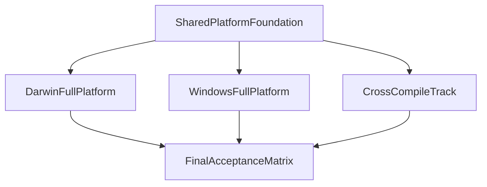

# Uya 多平台迁移总待办

本文档将现有以 macOS 为中心的迁移路线，扩展为一份统一的**多平台总蓝图**。默认目标覆盖：

- Linux `x86_64` 作为持续回归基线
- Darwin `x86_64`
- Darwin `arm64`
- Windows `x86_64`
- 交叉编译链路（`C99-only`、`hosted cross-link`、`full-cross low-level`）

目标级别采用：

- Darwin：`full_platform`
- Windows：`full_platform`
- 交叉编译：`full_cross_platform`

---

## 总体原则

1. 先做**共享平台基础**，再做任何平台特定 bring-up。
2. Darwin 是第一条非 Linux 原生平台线，用来验证共享抽象是否成立。
3. Windows 不再作为“以后再说的可选注释”，而是独立迁移主线。
4. 交叉编译不再等同于“生成 C99”，而是单独定义分层目标与验收矩阵。
5. `hosted` 主线优先，`--nostdlib`、线程、异步都是高风险后置子项目。

---

## 四条主线

### 1. 共享平台基础

详细拆分见 [todo_platform_shared_foundation.md](todo_platform_shared_foundation.md)。

**Linux 侧**：共享基础中可在 Linux 完成的条目已收敛（工具链变量、`main.uya` 宿主链接、`codegen` 目标宏、测试脚本）；Darwin/Windows **运行时**验收仍在各平台完成。

这一主线负责把当前 Linux-only 的宿主假设、工具链假设和链接假设收敛成统一模型，核心文件包括：

- [../Makefile](../Makefile)
- [../src/compile.sh](../src/compile.sh)
- [../src/main.uya](../src/main.uya)
- [../src/codegen/c99/main.uya](../src/codegen/c99/main.uya)
- [../tests/run_programs_parallel.sh](../tests/run_programs_parallel.sh)
- [../tests/run_cross_platform_tests.sh](../tests/run_cross_platform_tests.sh)

需要先固定的公共维度：

- `host_os`
- `host_arch`
- `target_os`
- `target_arch`
- `target_triple`
- `runtime_mode`
- `link_mode`
- `toolchain`
- `zig`
- `cc_driver`

### 2. Darwin 原生全平台线

Darwin 线已纳入本文档的跨平台迁移总规划。

Darwin 线保留现有 Phase 1-8 的拆分，但它现在是建立在“共享平台基础”之上的**第一条完整原生平台线**，而不是总迁移文档本身。

### 3. Windows 原生全平台线

总文档见 [todo_windows_migration.md](todo_windows_migration.md)。

Windows 线按 `full_platform` 规划，至少覆盖：

- hosted 构建、自举、主测试基线
- `@syscall` / `syscall` / `osal` / runtime
- 线程与同步原语
- `--nostdlib` / PE-COFF 启动与链接
- `std.async` / IOCP

### 4. 交叉编译主线

总文档见 [todo_cross_compile.md](todo_cross_compile.md)。

交叉编译单独分层，不再混在 Darwin 或 Windows 文档里：

- `C99-only`
- `hosted cross-link`
- `full-cross low-level`

---

## 依赖顺序

执行要求：

- 共享平台基础必须先完成到“host/target + toolchain 抽象落地”。
- Darwin 应先于 Windows 跑通，作为第二个平台模板。
- Windows 不应在共享基础未稳定前提前硬做 `pthread`、IOCP 或 `--nostdlib`。
- `full-cross low-level` 必须以后置阶段推进，不能早于 Darwin/Windows 原生基线。

---

## 分阶段总览

| Track | 阶段 | 状态 | 目标 |
|------|------|------|------|
| Shared | 共享平台基础 | 未开始 | 固定 host/target/toolchain/runtime/link 统一模型 |
| Darwin | 原生 Darwin | 进行中规划 | 形成第一条完整非 Linux 原生平台 |
| Windows | 原生 Windows | 未开始 | 形成第二条完整非 Linux 原生平台 |
| Cross | 交叉编译 | 未开始 | 建立跨宿主到多目标的分层产物链 |
| Final | 验收矩阵与文档收口 | 未开始 | 同步原生平台与交叉编译状态 |

---

## 当前强阻塞点

- [ ] [../src/compile.sh](../src/compile.sh) 仍直接调用 `gcc`
- [ ] [../src/main.uya](../src/main.uya) 仍写死 Linux GCC 路径
- [ ] [../src/codegen/c99/main.uya](../src/codegen/c99/main.uya) 中 `@syscall` 仍只支持 Linux x86-64
- [ ] [../lib/std/runtime/runtime.uya](../lib/std/runtime/runtime.uya) 仍有 Linux-only 退出假设
- [ ] [../lib/libc/pthread.uya](../lib/libc/pthread.uya) 仍是 Linux `clone/futex/waitpid` 路线
- [ ] [../lib/std/async_event.uya](../lib/std/async_event.uya) 仍只有 Linux `epoll`
- [ ] [../tests/run_programs_parallel.sh](../tests/run_programs_parallel.sh) 和 [../tests/run_cross_platform_tests.sh](../tests/run_cross_platform_tests.sh) 仍缺少统一工具链入口

---

## 最终验收矩阵

最终验收至少记录以下维度：

### 原生平台

- [ ] Linux `x86_64`
- [ ] Darwin `x86_64`
- [ ] Darwin `arm64`
- [ ] Windows `x86_64`

### 原生能力

- [ ] hosted
- [ ] `pthread`
- [ ] `--nostdlib`
- [ ] `std.async`

### 交叉编译

- [ ] Linux/macOS 宿主 -> Darwin 目标：`C99-only`
- [ ] Linux/macOS 宿主 -> Darwin 目标：`hosted cross-link`
- [ ] Linux/macOS 宿主 -> Darwin 目标：`full-cross low-level`
- [ ] Linux/macOS 宿主 -> Windows 目标：`C99-only`
- [ ] Linux/macOS 宿主 -> Windows 目标：`hosted cross-link`
- [ ] Linux/macOS 宿主 -> Windows 目标：`full-cross low-level`

---

## 文档入口

- 总蓝图：`todo_multiplatform_migration.md`
- 共享平台基础：`todo_platform_shared_foundation.md`
- Darwin：本文档内的 Darwin 原生全平台线
- Windows：`todo_windows_migration.md`
- 交叉编译：`todo_cross_compile.md`

